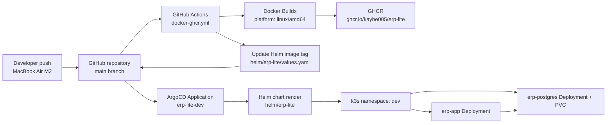
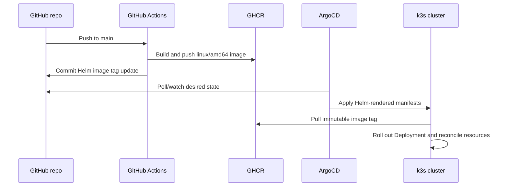
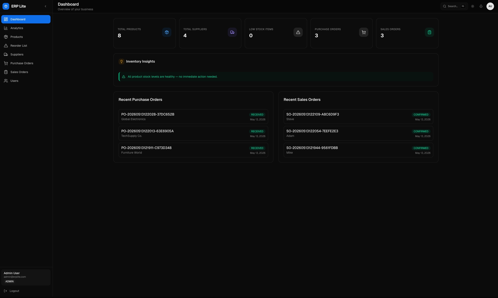
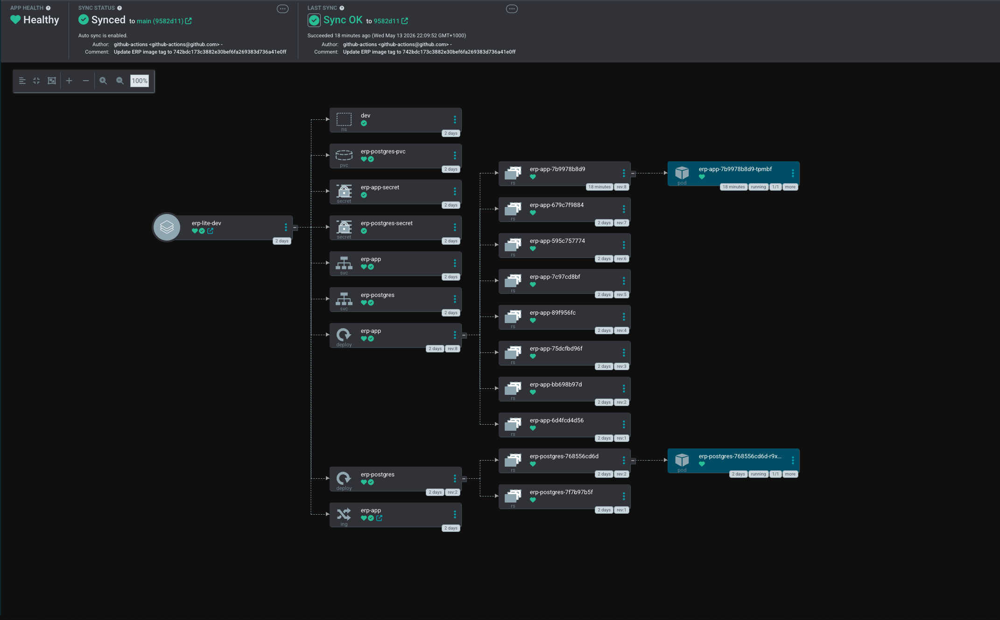
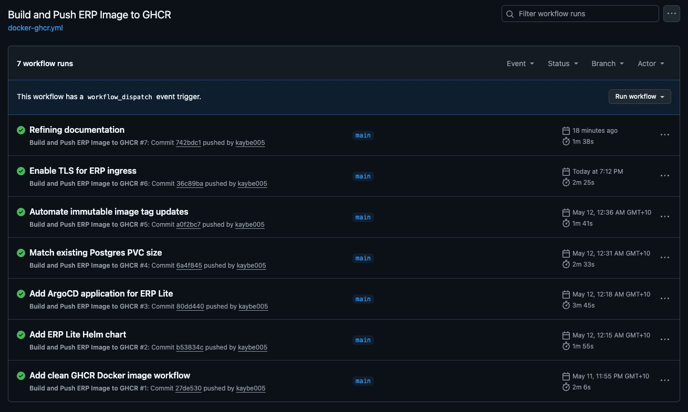
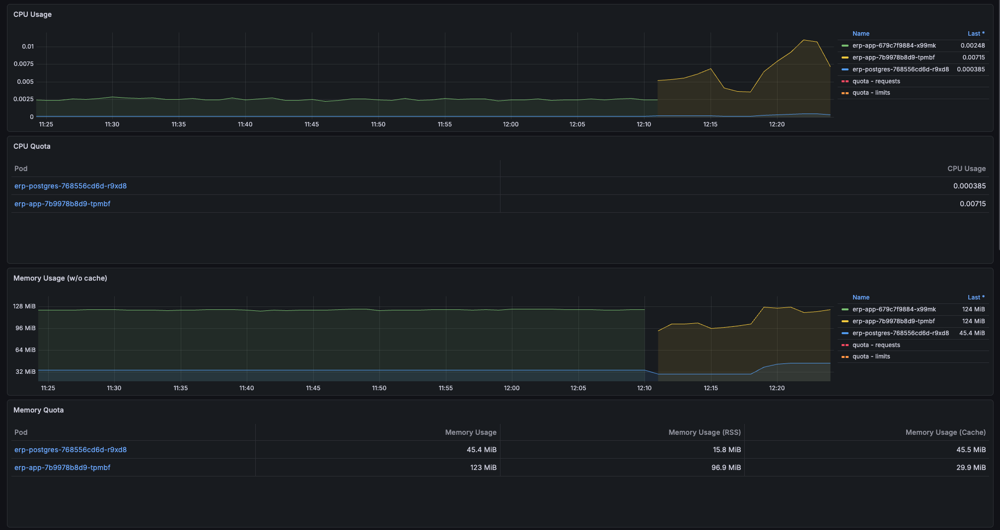
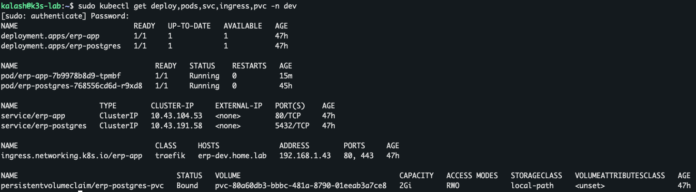

# ERP Lite — GitOps Homelab Deployment

ERP Lite is a full-stack ERP-style inventory and order management application deployed through a homelab GitOps workflow. The application itself is built with Next.js, React, TypeScript, Prisma, NextAuth, and PostgreSQL. The platform side demonstrates container builds, immutable image tagging, Kubernetes manifests through Helm, ArgoCD reconciliation, Traefik ingress, TLS, persistent storage, and cluster observability.

This is a **homelab production-style workflow**, not a high-availability production system. The deployment runs on a single-node k3s cluster in a Proxmox VM and is intended to show practical DevOps/platform engineering readiness: CI/CD, GitOps, Kubernetes operations, debugging, persistence, TLS, and observability.

## Overview

ERP Lite started as a normal full-stack web app and evolved into a platform deployment project. The repository now contains:

| Area             | Implementation                                                                           |
| ---------------- | ---------------------------------------------------------------------------------------- |
| Application      | Next.js App Router, React, TypeScript, server/client components, REST API route handlers |
| Data layer       | Prisma schema, migrations, seed data, PostgreSQL                                         |
| Authentication   | NextAuth credentials provider with bcrypt password hashing and JWT sessions              |
| Containerization | Multi-stage Dockerfile and Docker Compose for local development                          |
| CI/CD            | GitHub Actions workflow that builds and pushes AMD64 images to GHCR                      |
| Deployment       | Helm chart for app, PostgreSQL, services, ingress, PVC, and probes                       |
| GitOps           | ArgoCD Application manifest targeting the Helm chart                                     |
| Homelab platform | k3s, Traefik, cert-manager, Prometheus/Grafana, AdGuard DNS, Proxmox                     |

The goal is to make the deployment path explicit:

```text
code change -> GitHub Actions -> GHCR image -> Helm values update -> ArgoCD sync -> k3s rollout
```

## Why This Project Exists

The purpose of this project is to move beyond "I containerized a web app" and build a realistic internal platform workflow around it. ERP Lite is intentionally small enough to understand end to end, but broad enough to demonstrate the kind of operational work expected from junior DevOps, platform, cloud, or infrastructure engineers.

The project demonstrates:

- Building and running a database-backed web app locally and in Kubernetes.
- Handling container architecture mismatches between Apple Silicon development machines and AMD64 Linux nodes.
- Publishing container images to a registry and deploying by immutable Git SHA tags.
- Managing Kubernetes resources through Helm rather than one-off YAML.
- Using ArgoCD as the deployment controller and Git as the desired-state source.
- Exposing internal services through Traefik ingress and internal TLS.
- Keeping PostgreSQL internal-only with persistent storage.
- Debugging real operational issues around image pulls, DNS, storage drift, migrations, and observability.

## Architecture

### CI/CD and GitOps Flow



The active workflow builds two image tags:

- `${{ github.sha }}`: immutable deployment tag used by Helm.
- `dev`: mutable convenience tag for quick inspection.

The Helm chart currently deploys the immutable SHA tag from `helm/erp-lite/values.yaml`.

### Runtime Traffic Flow

```mermaid
flowchart LR
    Browser["Browser<br/>https://erp-dev.home.lab"] --> DNS["AdGuard Home<br/>DNS rewrite"]
    DNS --> Node["k3s node IP"]
    Node --> Traefik["Traefik Ingress Controller"]
    Traefik --> Ingress["Ingress<br/>host: erp-dev.home.lab<br/>TLS secret: erp-dev-tls-secret"]
    Ingress --> AppSvc["erp-app Service<br/>ClusterIP:80"]
    AppSvc --> AppPod["erp-app Pod<br/>Next.js :3000"]
    AppPod --> PgSvc["erp-postgres Service<br/>ClusterIP:5432"]
    PgSvc --> PgPod["erp-postgres Pod"]
    PgPod --> PVC["PersistentVolumeClaim<br/>erp-postgres-pvc"]
```



PostgreSQL is not exposed outside the cluster. The only external application entrypoint is the Traefik ingress host.

### GitOps Reconciliation Flow



### Repository vs Homelab Platform

Some platform components are installed in the cluster but are not currently managed by this repository.

| Component                           | In this repo? | Notes                                                         |
| ----------------------------------- | ------------- | ------------------------------------------------------------- |
| ERP app Dockerfile                  | Yes           | Multi-stage Node image for Next.js                            |
| GitHub Actions GHCR build           | Yes           | Builds `linux/amd64` and updates Helm tag                     |
| Helm chart                          | Yes           | App, Postgres, PVC, Services, Ingress, probes, namespace      |
| ArgoCD Application                  | Yes           | `argocd/erp-lite-dev.yaml`                                    |
| Traefik ingress controller          | No            | Installed as cluster platform component                       |
| cert-manager                        | No            | Installed in cluster; Ingress references `erp-dev-tls-secret` |
| ClusterIssuer/Certificate manifests | No            | Created during homelab setup; good future GitOps addition     |
| Prometheus/Grafana stack            | No            | Installed as cluster platform component                       |
| Loki/Promtail                       | No            | Explored, but log ingestion is not finalized in this repo     |

## Tech Stack

| Category               | Tools                                                                                 |
| ---------------------- | ------------------------------------------------------------------------------------- |
| Application            | Next.js 16 App Router, React 19, TypeScript 5.7, SWR                                  |
| UI                     | Tailwind CSS v4, Radix UI primitives, shadcn-style components, lucide-react, Recharts |
| Auth                   | NextAuth v4 credentials provider, bcryptjs, JWT sessions                              |
| Database               | PostgreSQL 16, Prisma ORM 5.10, Prisma migrations and seed data                       |
| Containerization       | Docker, multi-stage Dockerfile, Docker Compose                                        |
| CI/CD                  | GitHub Actions, Docker Buildx, GHCR                                                   |
| Kubernetes/GitOps      | k3s, Helm, ArgoCD                                                                     |
| Networking/TLS         | Traefik ingress, cert-manager, self-signed/internal TLS, AdGuard DNS rewrites         |
| Observability          | Prometheus and Grafana installed in the homelab cluster                               |
| Homelab infrastructure | Dell OptiPlex 7080, Proxmox, single-node k3s VM, MacBook Air M2 development machine   |

## Application Features

These features are present in the repository code.

### Authentication and Access Control

- Credentials-based login with NextAuth.
- Password hashes generated with bcrypt.
- JWT-backed sessions containing user ID and role.
- `ADMIN` and `STAFF` roles in Prisma.
- Protected dashboard layout that redirects unauthenticated users to `/login`.
- Admin-only Users page and API routes.
- User management logic prevents deleting/deactivating the last active admin.

Demo users are seeded by `prisma/seed.ts`:

| Role  | Email               | Password   |
| ----- | ------------------- | ---------- |
| Admin | `admin@erplite.com` | `admin123` |
| Staff | `staff@erplite.com` | `staff123` |

### Inventory and Products

- Product CRUD with name, SKU, category, description, unit price, stock quantity, and reorder level.
- Unique SKU enforcement.
- Low-stock detection when `quantityInStock <= reorderLevel`.
- Reorder list for products at or below their reorder threshold.
- Product-to-supplier linking through the `SupplierProduct` junction table.
- Product deletion is blocked when purchase or sales order history exists.

### Suppliers

- Supplier CRUD with company name, contact name, email, phone, and address.
- Supplier deletion is blocked when purchase orders exist.
- Supplier-product relationships are used to control which products can be ordered from each supplier.

### Purchase Orders

- Purchase orders contain one or more line items.
- Purchase order statuses: `PENDING`, `RECEIVED`, `CANCELLED`.
- Creating a purchase order validates that every product is linked to the selected supplier.
- Validation happens inside a Prisma transaction, so direct API calls cannot bypass the rule.
- Marking a pending purchase order as received increments product stock.
- Cancelling a pending purchase order prevents receipt.
- Reorder list can prefill purchase order creation for a selected low-stock product.

### Sales Orders

- Sales orders contain one or more line items.
- Sales order statuses: `CONFIRMED`, `CANCELLED`.
- Sales order creation checks stock availability before writing the order.
- Confirmed sales decrement product stock inside a transaction.
- Cancelling a confirmed sales order restores stock quantities.
- Supports customer name or walk-in customer flow.

### Dashboard and Analytics

- Dashboard summary cards for products, suppliers, low-stock items, purchase orders, and sales orders.
- Recent purchase and sales order panels.
- Inventory insights for low-stock products and missing supplier links.
- Analytics page with:
  - 30-day revenue, cost, gross profit, and low-stock KPI cards.
  - Six-month revenue vs costs chart.
  - Top products by revenue.
  - Order status snapshot.

### UX and App Structure

- Collapsible sidebar navigation.
- Command palette for page navigation and quick actions.
- Light/dark theme support through `next-themes`.
- Reusable service layer in `services/*.service.ts`.
- API route handlers under `app/api/*`.
- Zod validation and Prisma-backed business rules with schemas in `lib/validations.ts`.

## CI/CD Pipeline

The active workflow is `.github/workflows/docker-ghcr.yml`.

It runs on:

- Pushes to `main`.
- Manual `workflow_dispatch`.

Pipeline steps:

1. Check out the repository.
2. Set up QEMU.
3. Set up Docker Buildx.
4. Log in to GitHub Container Registry using `GITHUB_TOKEN`.
5. Build and push the Docker image for `linux/amd64`.
6. Publish both immutable and mutable tags:
   - `ghcr.io/kaybe005/erp-lite:${{ github.sha }}`
   - `ghcr.io/kaybe005/erp-lite:dev`
7. Update `helm/erp-lite/values.yaml` with the Git SHA image tag.
8. Commit the Helm value change back to `main` with `[skip ci]`.

The `linux/amd64` target is important because the development machine is Apple Silicon, but the k3s node runs on an AMD64 Dell OptiPlex. Without an explicit platform target, images built locally on the MacBook can be ARM64 and fail on the cluster node.

The immutable Git SHA tag makes rollouts and rollbacks easier to reason about because the deployed image can be tied directly to a commit.

Current CI caveat: the active workflow focuses on image build/push and Helm tag update. Automated tests, linting, and smoke checks are good next additions.

## Kubernetes Deployment

The Helm chart deploys into the `dev` namespace by default.

| Resource   | Name                  | Purpose                                 |
| ---------- | --------------------- | --------------------------------------- |
| Namespace  | `dev`                 | Isolated namespace for ERP Lite         |
| Secret     | `erp-app-secret`      | App environment variables               |
| Deployment | `erp-app`             | Next.js application pod                 |
| Service    | `erp-app`             | Internal ClusterIP service on port 80   |
| Ingress    | `erp-app`             | Traefik route for `erp-dev.home.lab`    |
| Secret     | `erp-postgres-secret` | PostgreSQL environment variables        |
| Deployment | `erp-postgres`        | PostgreSQL pod                          |
| Service    | `erp-postgres`        | Internal ClusterIP service on port 5432 |
| PVC        | `erp-postgres-pvc`    | Persistent PostgreSQL storage           |

The app Deployment includes:

- One replica by default.
- Image from GHCR.
- `imagePullPolicy: Always`.
- Container port `3000`.
- Environment variables from `erp-app-secret`.
- Readiness probe on `/`.
- Liveness probe on `/`.

PostgreSQL is exposed only through a ClusterIP service. It is reachable from the app pod but not directly from the LAN.

Current Kubernetes caveats:

- Secrets are templated in Helm for homelab simplicity. A stronger pattern would use External Secrets, Sealed Secrets, SOPS, or another secret management workflow.
- Resource requests and limits are not yet defined.
- NetworkPolicies are not yet defined.
- PostgreSQL runs in-cluster for learning purposes; it is not a managed database service.

## Helm Chart

Chart location:

```text
helm/erp-lite/
├── Chart.yaml
├── values.yaml
└── templates/
    ├── namespace.yaml
    ├── app.yaml
    └── postgres.yaml
```

`values.yaml` controls:

- Namespace.
- App image repository, tag, and pull policy.
- App name, replica count, and port.
- Ingress enablement, class, and host.
- PostgreSQL image, database name, user, password, port, and PVC size.

Helm is used instead of raw YAML because the deployment has values that change over time, especially the image tag. It also keeps the app, database, service, ingress, and PVC definitions grouped as one deployable unit for ArgoCD.

Render the chart locally:

```bash
helm template erp-lite helm/erp-lite
```

## ArgoCD GitOps

ArgoCD is configured by:

```text
argocd/erp-lite-dev.yaml
```

The Application points to:

- Repository: `https://github.com/kaybe005/erp-lite.git`
- Branch: `main`
- Path: `helm/erp-lite`
- Destination namespace: `dev`

The manifest enables:

- Automated sync.
- Prune.
- Self-heal.
- Namespace creation through `CreateNamespace=true`.

This means the desired deployment state is stored in Git. Instead of manually applying Kubernetes YAML after every change, ArgoCD continuously reconciles the cluster back to what the Helm chart declares.

Useful commands:

```bash
kubectl apply -f argocd/erp-lite-dev.yaml
kubectl -n argocd get applications.argoproj.io erp-lite-dev
kubectl -n dev get deploy,svc,ingress,pvc
```

## TLS and Ingress

ERP Lite is exposed through Traefik:

```text
https://erp-dev.home.lab
```

The homelab uses:

- AdGuard Home DNS rewrite: `erp-dev.home.lab -> k3s node IP`.
- Traefik as the Kubernetes ingress controller.
- cert-manager for certificate automation.
- A self-signed/internal certificate for local TLS.

The Helm Ingress references:

```yaml
tls:
  - hosts:
      - erp-dev.home.lab
    secretName: erp-dev-tls-secret
```

The current repo does not include the cert-manager `ClusterIssuer` or `Certificate` manifests. Those were created during homelab setup and should be moved into GitOps as a future improvement.

Because the certificate is internal/self-signed, browsers will show a trust warning unless the local CA is trusted on the client device. This is expected for the current homelab setup and is different from public Let's Encrypt TLS.

## Database and Persistence

PostgreSQL runs inside the `dev` namespace as `erp-postgres`.

The database layer includes:

- Prisma schema in `prisma/schema.prisma`.
- Prisma migrations in `prisma/migrations/`.
- Seed data in `prisma/seed.ts`.
- PostgreSQL PVC: `erp-postgres-pvc`.

The PVC allows database state to survive pod restarts and app rollouts. This was important during the homelab deployment because deleting/restarting pods should not wipe ERP data.

Prisma migrations are currently a separate operational step. The app Deployment does not automatically run migrations before rollout.

Manual migration commands used during setup:

```bash
kubectl -n dev exec deploy/erp-app -- npm run db:migrate:deploy
kubectl -n dev exec deploy/erp-app -- npm run db:seed
```

Future improvement: add a Helm-managed Kubernetes Job or ArgoCD sync hook that runs `prisma migrate deploy` before the app rollout is considered complete. Seeding should remain explicit and environment-aware.

## Observability

The homelab cluster has Prometheus and Grafana installed through the monitoring stack. Grafana was exposed through ingress and used to inspect Kubernetes node, namespace, pod, and workload health.

What is currently true:

- Prometheus/Grafana are installed as cluster-level platform services.
- kube-prometheus-stack dashboards were used for Kubernetes visibility.
- ERP Lite does not yet include custom Prometheus metrics or ServiceMonitor manifests in this repo.
- Loki/Promtail log collection was explored, but log ingestion is not finalized and is not claimed as complete here.

Future observability work:

- Add app-specific health and metrics endpoints.
- Add ServiceMonitor/PodMonitor resources if the monitoring stack supports them.
- Finalize Loki/Promtail or another log pipeline.
- Add dashboard screenshots and runbook notes under `docs/`.

## Key Problems Solved

| Problem                               | Cause                                                            | Fix / lesson                                                                                         |
| ------------------------------------- | ---------------------------------------------------------------- | ---------------------------------------------------------------------------------------------------- |
| ARM64 image on AMD64 node             | MacBook M2 builds ARM64 images by default                        | GitHub Actions now uses Docker Buildx with `platforms: linux/amd64`                                  |
| Docker CLI vs k3s runtime confusion   | k3s uses containerd, not the local Docker daemon                 | Local Docker images are not automatically available to Kubernetes                                    |
| Manual image import did not scale     | Early deployment relied on locally imported images               | Moved to GHCR-based image pulls                                                                      |
| GHCR pulls blocked                    | Old manual deployment used `imagePullPolicy: Never`              | Helm now uses `imagePullPolicy: Always`                                                              |
| Image traceability                    | Mutable tags make rollouts hard to audit                         | Helm deploys immutable Git SHA image tags                                                            |
| Raw YAML drift                        | Manual Kubernetes resources became hard to repeat                | Migrated app and database resources into a Helm chart                                                |
| GitOps ownership                      | Manual `kubectl` changes were not the desired long-term workflow | ArgoCD Application now reconciles the Helm chart from Git                                            |
| PVC drift                             | Existing PVC size differed from Helm values                      | Matched Helm values to the existing PVC and learned stateful resource immutability constraints       |
| Missing database schema after rollout | App deployment and DB migrations are separate concerns           | Ran `prisma migrate deploy` manually; future improvement is a migration Job or sync hook             |
| TLS setup                             | Internal apps still benefit from HTTPS                           | Added Traefik Ingress TLS using a cert-manager-created internal certificate secret                   |
| DNS confusion                         | Old docker-prod VM and k3s VM caused routing ambiguity           | Standardized AdGuard DNS rewrites to point `erp-dev.home.lab` and `grafana.home.lab` at the k3s node |
| Grafana access issues                 | Credentials/service exposure needed debugging                    | Reset credentials, exposed Grafana through ingress, and verified Kubernetes dashboards               |

## Local Development

Prerequisites:

- Node.js 20+ or 22+.
- npm.
- Docker or Docker Desktop.

Set up local environment:

```bash
cp .env.example .env
docker compose up -d db
npm install
npm run db:generate
npm run db:migrate:deploy
npm run db:seed
npm run dev
```

Open:

```text
http://localhost:3000
```

The sample `.env.example` targets the Docker Compose database on localhost port `5433`.

Run the app with Docker Compose:

```bash
docker compose up -d db
docker compose run --rm app npm run db:migrate:deploy
docker compose run --rm app npm run db:seed
docker compose up --build app
```

Useful scripts:

```bash
npm run dev                 # Start Next.js dev server
npm run build               # Generate Prisma client and build Next.js
npm run start               # Start production Next.js server
npm run db:generate         # Generate Prisma client
npm run db:migrate          # Create/apply a dev migration
npm run db:migrate:deploy   # Apply existing migrations
npm run db:seed             # Seed demo users/products/suppliers
npm run db:push             # Push schema in development only
```

## Homelab Deployment

The homelab deployment target is a single-node k3s cluster running in a Proxmox VM on a Dell OptiPlex 7080.

Approximate deployment flow:

1. Commit and push application changes to `main`.
2. GitHub Actions builds a `linux/amd64` image with Docker Buildx.
3. GitHub Actions pushes the image to GHCR.
4. GitHub Actions updates `helm/erp-lite/values.yaml` with the immutable commit SHA.
5. ArgoCD detects the Helm chart change.
6. ArgoCD syncs the app into the `dev` namespace.
7. k3s pulls the image from GHCR and rolls out `erp-app`.
8. Manual Prisma migrations are run when schema changes are introduced.
9. AdGuard DNS routes `erp-dev.home.lab` to the k3s node.
10. Traefik routes HTTPS traffic to the app service.

Useful cluster checks:

```bash
kubectl -n dev get pods
kubectl -n dev get deploy,svc,ingress,pvc
kubectl -n dev describe ingress erp-app
kubectl -n dev logs deploy/erp-app
kubectl -n dev rollout status deploy/erp-app
```

Check the rendered image tag:

```bash
helm template erp-lite helm/erp-lite | grep "image:"
```

Current secret note: the chart contains placeholder/simple secret values suitable for a homelab demonstration. A serious next step is moving secrets to Sealed Secrets, External Secrets, SOPS, or another GitOps-compatible secret workflow.

## Screenshots

## Screenshots

### ERP Dashboard



### ArgoCD GitOps Application



### GitHub Actions Image Pipeline



### Grafana Kubernetes Monitoring



### Kubernetes Resources



## Future Improvements

- Add a Helm/ArgoCD migration Job for `prisma migrate deploy`.
- Move secrets to External Secrets, Sealed Secrets, or SOPS.
- Commit cert-manager `ClusterIssuer` and `Certificate` manifests so TLS is fully GitOps-managed.
- Replace self-signed/internal TLS with Let's Encrypt using a public domain or DNS-01 challenge.
- Finalize Loki/Promtail or another log ingestion pipeline.
- Add PostgreSQL backup and restore automation.
- Add resource requests and limits for app and database workloads.
- Add NetworkPolicies to restrict pod-to-pod communication.
- Add image pull secret support if the GHCR package is private.
- Add automated CI checks: lint, type check, unit tests, build verification, and smoke tests.
- Add Kubernetes readiness checks for database availability.
- Add staging/prod values files or separate ArgoCD Applications.
- Add Terraform or Ansible for Proxmox/k3s/bootstrap provisioning.
- Expand from single-node k3s to a multi-node cluster.
- Add app-specific metrics and ServiceMonitor resources.
- Add documentation under:
  - `docs/architecture.md`
  - `docs/runbook.md`
  - `docs/troubleshooting.md`
  - `docs/screenshots/`

## Interview Talking Points

### What I Built

I built a full-stack ERP-style application and deployed it through a homelab GitOps workflow. The project includes the app, database schema, container image, GitHub Actions image pipeline, Helm chart, ArgoCD Application, Kubernetes ingress, TLS, persistent PostgreSQL storage, and monitoring through the homelab platform.

### Why GitOps

GitOps gives the cluster a declared desired state. Instead of manually changing Kubernetes resources and trying to remember what changed, the Helm chart in Git becomes the source of truth and ArgoCD reconciles the cluster back to that state.

### Why Immutable Tags

Immutable Git SHA image tags make deployments traceable. If a rollout works or fails, I can identify exactly which commit produced that image. Rollback is also clearer because Helm can point back to an earlier SHA.

### Why ClusterIP for PostgreSQL

The app needs database access, but the LAN does not. Keeping PostgreSQL behind a ClusterIP reduces exposure and forces access through Kubernetes-internal networking. External users reach only the app through Traefik ingress.

### What Went Wrong and How I Debugged It

The most important debugging path was the ARM64/AMD64 mismatch. The image worked on the Apple Silicon development machine but failed on the AMD64 k3s node. That led to learning the difference between local Docker images and k3s containerd images, then moving to GHCR pulls and an explicit Buildx `linux/amd64` build.

Other useful incidents were the `imagePullPolicy: Never` issue, PVC drift with ArgoCD, and realizing Prisma migrations need their own deployment step rather than assuming app rollout creates database tables.

### What I Would Improve Next

The next platform improvements are migration automation, secret management, GitOps-managed TLS resources, PostgreSQL backups, and stronger CI checks. Those would move the project closer to a repeatable internal platform pattern while keeping the homelab scope honest.

## Resume Bullet Suggestions

- Built and deployed a full-stack ERP application on a homelab k3s cluster using Docker, Helm, ArgoCD, Traefik, PostgreSQL, and GitHub Actions.
- Implemented a GitOps deployment workflow where GitHub Actions builds `linux/amd64` images, pushes to GHCR, updates Helm with immutable Git SHA tags, and ArgoCD reconciles Kubernetes state.
- Debugged and resolved ARM64/AMD64 container architecture mismatch between Apple Silicon development builds and an AMD64 k3s node by adopting Docker Buildx platform targeting.
- Migrated manual Kubernetes resources into a Helm chart covering Deployments, ClusterIP Services, Ingress, Secrets, readiness/liveness probes, and PVC-backed PostgreSQL.
- Configured internal homelab ingress and TLS with Traefik, cert-manager, self-signed certificates, and AdGuard DNS rewrites for `erp-dev.home.lab`.
- Operated and troubleshot a Kubernetes-based application deployment, including image pull policy issues, GHCR pulls, PVC drift, Prisma migration separation, DNS routing, and Grafana dashboard access.
